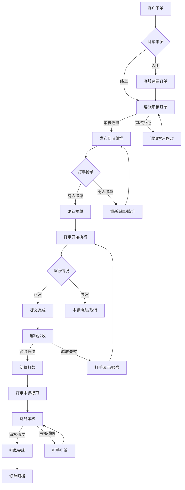
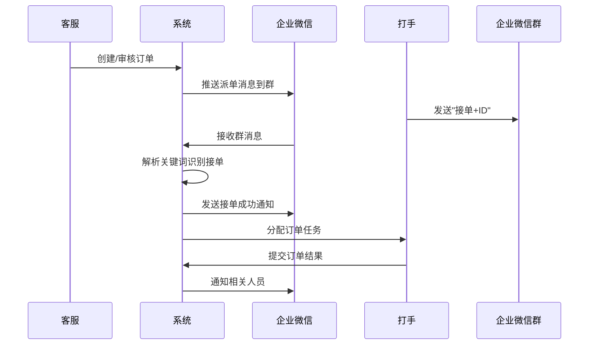
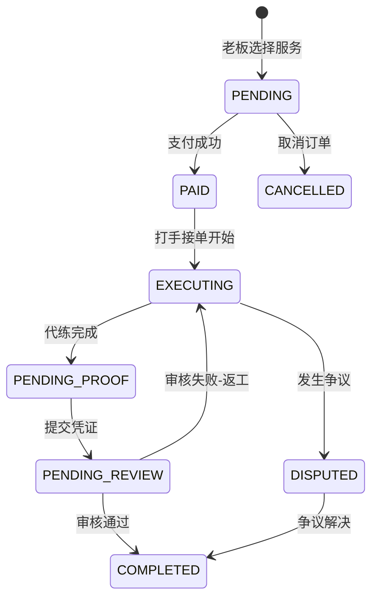

# 三角洲代练工作室管理系统 - 产品需求文档

## 1. 产品概述

三角洲代练工作室管理系统是一款专为游戏代练工作室打造的全流程订单管理与运营平台。系统覆盖从客户下单、客服发单、打手接单、订单执行、完结结算到提现审核的完整业务闭环，同时提供人员绩效管理、财务对账、风险管控等核心功能。

通过与企业微信深度集成，实现派单群自动推送消息、打手接单确认、订单状态实时同步等功能，大幅提升工作室运营效率。

### 目标用户

- **工作室老板**：统筹管理、查看经营数据、审批提现
- **客服人员**：接收客户订单、发布代练任务、与客户沟通
- **打手团队**：接收任务、执行订单、完成结算
- **财务人员**：对账审核，资金管理、报表统计

### 核心价值

- 全流程数字化管理，订单状态实时透明
- 企业微信深度集成，派单接单自动化
- 多维度绩效统计，激励打手积极性
- 完善的财务对账机制，保障资金安全
- 风险预警系统，降低运营风险

## 2. 核心功能模块

### 2.1 用户角色与权限

| 角色 | 注册方式 | 核心权限 | 功能范围 |
|------|----------|----------|----------|
| 管理员/老板 | 系统初始化 | 全部功能 | 系统配置、全局数据查看、提现审批、财务管理 |
| 客服 | 管理员创建 | 订单管理、客户管理 | 订单创建编辑、派单操作、客户沟通记录 |
| 打手 | 管理员创建 | 我的订单、收益查看 | 接单操作、订单执行、提现申请 |
| 财务 | 管理员创建 | 财务对账、结算管理 | 对账审核、结算操作、报表生成 |

### 2.2 订单全生命周期管理

#### 2.2.1 订单创建（客户下单）

- **客户端下单入口**：客户通过网页/小程序提交代练需求
- **客服手动创建**：客服根据客户需求在系统内创建订单
- **订单信息字段**：
  - 游戏名称（《三角洲行动》）
  - 代练内容（段位代练、任务代练、物资代练等）
  - 客户账号密码（加密存储）
  - 代练要求与备注
  - 预计完成时间
  - 代练价格
  - 客户联系方式

#### 2.2.2 客服发单

- **订单审核**：客服审核订单信息，确认代练内容和价格
- **派单群推送**：自动将订单信息推送到企业微信派单群
- **推送内容**：
  ```
  【新代练单】
  游戏：《三角洲行动》
  内容：专家→荣耀段位代练
  价格：¥500
  截止：2024-01-15 18:00
  特殊要求：无
  回复"接单+ID"即可抢单！
  ```
- **订单挂起**：可设置订单等待打手接单

#### 2.2.3 打手接单

- **派单群抢单**：打手在企业微信群内发送"接单+打手ID"抢单
- **系统自动处理**：
  - 识别抢单消息
  - 确认打手资质（等级、信誉分、历史完成率）
  - 分配订单给最优打手
  - 发送接单成功通知
- **接单确认**：打手确认订单，开始执行代练

#### 2.2.4 订单执行

- **打手操作**：
  - 开始代练（更新订单状态）
  - 上传进度截图
  - 提交代练结果
  - 标记订单完成
- **监控机制**：
  - 超时预警（即将超时的订单）
  - 进度查询（客户可查看代练进度）
  - 异常上报（遇到问题可申请协助）

#### 2.2.5 完结结算

- **订单验收**：客服/客户验收代练结果
- **价格调整**：根据实际完成情况调整价格（奖惩机制）
- **收益计算**：
  - 打手收益 = 代练价格 × 打手分成比例
  - 工作室利润 = 代练价格 - 打手收益 - 平台抽成
- **订单归档**：订单状态变更为"已完成"

#### 2.2.6 提现审核

- **打手申请**：打手发起提现申请
- **财务审核**：
  - 核实打手账户余额
  - 检查是否存在未处理投诉
  - 确认提现金额
- **打款处理**：财务执行打款操作
- **提现完成**：更新打手账户余额，生成财务记录

### 2.3 企业微信集成功能

#### 2.3.1 消息推送

- **派单消息**：新订单推送到派单群
- **接单通知**：打手接单成功通知
- **订单变更**：订单状态变更通知
- **逾期提醒**：订单即将逾期的提醒
- **结算通知**：收益到账通知

#### 2.3.2 消息接收与处理

- **接单识别**：自动识别群内"接单"关键字
- **关键词回复**：支持关键词自动回复
- **消息存档**：保存所有群消息记录

#### 2.3.3 配置项

- 企业ID、企业应用AgentID、企业应用Secret
- 派单群聊ID
- 关键词白名单
- 消息模板配置

### 2.4 人员绩效管理

#### 2.4.1 打手绩效

- **接单量统计**：按时段统计打手接单数量
- **完成率统计**：订单完成率、按时完成率
- **质量评分**：客户对打手的评分
- **信誉分体系**：基于历史表现的信誉积分
- **收益统计**：打手总收入、净收入

#### 2.4.2 客服绩效

- **订单处理量**：创建的订单数量
- **订单成交率**：下单转化率
- **客户满意度**：客户对服务的评价
- **响应速度**：平均响应时间

#### 2.4.3 绩效报表

- **个人绩效报表**：各岗位人员绩效详情
- **团队绩效报表**：工作室整体绩效
- **排行榜**：打手接单排行榜、收益排行榜

### 2.5 财务对账管理

#### 2.5.1 资金流水

- **收入记录**：客户付款记录
- **支出记录**：打手结算、运营支出
- **账户余额**：各账户实时余额

#### 2.5.2 对账功能

- **日对账**：每日资金收支核对
- **月对账**：月度财务报表
- **订单对账**：单个订单的资金核对
- **异常检测**：发现账目异常自动预警

#### 2.5.3 财务报表

- **收入报表**：按日/周/月统计收入
- **支出报表**：打手结算、运营成本
- **利润报表**：工作室净利润统计
- **导出功能**：支持Excel导出

### 2.6 风险管控

#### 2.6.1 订单风险

- **逾期预警**：订单即将逾期的提前预警
- **账号安全**：客户账号加密存储、操作日志
- **订单纠纷**：订单异常处理流程

#### 2.6.2 财务风险

- **资金预警**：账户余额低于阈值预警
- **异常交易**：大额交易自动审核
- **对账差异**：账目不平自动告警

#### 2.6.3 人员风险

- **信誉红线**：信誉分低于阈值禁止接单
- **违规记录**：打手违规行为记录
- **黑名单机制**：严重违规者拉入黑名单

## 3. 核心业务流程

### 3.1 订单完整生命周期流程图



### 3.2 企业微信集成流程



## 4. 页面结构

### 4.1 页面清单

| 页面名称 | 模块名称 | 功能描述 |
|---------|----------|----------|
| 登录页面 | 登录表单 | 用户登录、记住密码 |
| 控制台 | 数据概览 | 今日订单、收益、待处理事项 |
| 订单管理 | 订单列表 | 订单筛选、搜索、详情查看 |
| 订单详情 | 订单详情 | 订单信息、执行进度、沟通记录 |
| 创建订单 | 订单表单 | 新建订单、选择游戏、填写要求 |
| 派单管理 | 派单列表 | 待派单订单、派单历史 |
| 打手管理 | 打手列表 | 打手信息、绩效、信誉分 |
| 打手详情 | 打手详情 | 接单记录、收益明细、评价 |
| 客户管理 | 客户列表 | 客户信息、消费记录、反馈 |
| 提现管理 | 提现列表 | 提现申请、审核处理 |
| 财务对账 | 对账报表 | 日报、月报、导出功能 |
| 绩效统计 | 绩效报表 | 个人/团队绩效、排行榜 |
| 系统设置 | 配置中心 | 企业微信、通知、权限等 |
| 风险预警 | 预警中心 | 逾期订单、异常账目、风险提示 |

### 4.2 角色首页

| 角色 | 首页模块 | 核心数据 |
|------|----------|----------|
| 老板 | 经营概览 | 今日收益、待处理订单、风险预警 |
| 客服 | 工作台 | 待派单订单、待验收订单、客户消息 |
| 打手 | 我的任务 | 待执行订单、执行中订单、收益统计 |
| 财务 | 财务中心 | 待审核提现、待对账订单、账户余额 |

## 5. 技术需求（非功能性需求）

### 5.1 性能要求

- 页面加载时间 < 3秒
- 订单操作响应 < 1秒
- 企业微信消息推送延迟 < 5秒

### 5.2 安全要求

- 客户账号密码加密存储（AES-256）
- 操作日志完整记录
- 敏感操作二次验证
- 数据定期备份

### 5.3 可用性要求

- 系统可用性 > 99.5%
- 支持多设备访问（PC端为主）
- 数据导出支持Excel格式

## 6. 会员卡储值系统

### 6.1 功能概述

会员卡储值系统为客户提供便捷的预付费服务，支持多种支付方式和灵活的储值套餐，提升客户粘性和消费体验。

### 6.2 会员卡管理

#### 6.2.1 会员类型定义

| 会员等级 | 开卡费用 | 储值优惠 | 服务折扣 | 专属福利 |
|---------|----------|----------|----------|----------|
| 普通会员 | 免费 | 无 | 无 | 基本服务 |
| 银卡会员 | ¥99 | 充100送10 | 9.5折 | 优先派单 |
| 金卡会员 | ¥299 | 充100送25 | 9折 | 专属客服 |
| 钻石会员 | ¥599 | 充100送50 | 8折 | 极速响应 |

#### 6.2.2 开卡流程

- **线上开卡**：客户通过网页/小程序自助开卡
- **线下开卡**：客服代为创建会员账户
- **开卡信息**：
  - 会员姓名、联系方式
  - 会员等级选择
  - 初始储值金额
  - 支付方式

#### 6.2.3 储值管理

- **储值套餐**：
  - 自定义金额储值
  - 固定套餐（¥100、¥300、¥500、¥1000）
  - 大额定制（需客服审核）
- **支付方式**：
  - 微信支付
  - 支付宝
  - 银行卡转账
  - 现金（线下）
- **优惠规则**：
  - 首次储值双倍赠送
  - 节日限时优惠
  - 会员等级赠送比例

### 6.3 储值与服务兑换

#### 6.3.1 余额消费机制

- **服务扣费**：订单完成后自动从会员余额扣除
- **余额不足**：提示充值或改用其他支付方式
- **余额冻结**：争议订单可冻结相应金额

#### 6.3.2 消费记录

- **实时账单**：每次消费即时通知
- **消费明细**：订单号、服务内容、金额、时间
- **余额变动**：清晰展示收入、支出、余额

### 6.4 会员权益

#### 6.4.1 等级权益

- **升级条件**：累计消费金额达标准
- **降级规则**：连续3个月无消费自动降级
- **权益展示**：会员中心清晰展示当前权益

#### 6.4.2 专属服务

- **优先派单**：高等级会员订单优先处理
- **专属客服**：金卡及以上配备专属客服
- **生日礼包**：会员生日当月赠送储值金

### 6.5 储值记录查询

#### 6.5.1 查询功能

- **时间筛选**：按日/周/月/自定义时间段
- **类型筛选**：储值记录、消费记录、退款记录
- **导出功能**：支持Excel导出对账

#### 6.5.2 管理功能

- **异常检测**：大额储值/消费自动标记
- **退款处理**：经审核后可退还储值余额
- **数据统计**：储值总额、消费总额、待消耗余额

## 7. 业务流程优化

### 7.1 完整服务流程

#### 7.1.1 优化后的业务流程

```
老板选择服务 → 客服发单 → 企业微信派单群发布 → 打手接单
    ↓
老板支付/余额扣款 → 服务执行 → 打手上传结单凭证 → 人工审核 → 完成结单
```

#### 7.1.2 凭证管理

- **凭证类型**：
  - 段位截图（开始/结束对比）
  - 物资截图（收集完成证明）
  - 视频片段（关键操作记录）
  - 文字说明（特殊情况备注）
- **上传要求**：
  - 至少1张完成证明
  - 支持多图上传
  - 图片水印（防伪标记）
  - 上传时间限制（订单完成后24小时内）

#### 7.1.3 审核流程

- **自动初审**：AI辅助验证凭证真实性
- **人工复审**：客服/考官进行人工审核
- **审核标准**：
  - 段位是否达标
  - 物资是否齐全
  - 是否符合特殊要求
- **审核结果**：
  - 通过：订单完成，进入结算
  - 失败：打手返工或重新提交凭证
  - 争议：升级处理，店长仲裁

### 7.2 订单状态追踪

#### 7.2.1 状态定义

| 状态码 | 状态名称 | 说明 |
|--------|----------|------|
| PENDING | 待支付 | 等待老板付款/余额扣款 |
| PAID | 已支付 | 支付成功，待执行 |
| EXECUTING | 执行中 | 打手正在进行代练 |
| PENDING_PROOF | 待提交凭证 | 代练完成，待上传凭证 |
| PENDING_REVIEW | 待审核 | 凭证已提交，待审核 |
| COMPLETED | 已完成 | 审核通过，订单完结 |
| CANCELLED | 已取消 | 订单取消 |
| DISPUTED | 争议中 | 存在争议，待处理 |

#### 7.2.2 状态流转



### 7.3 进度通知机制

#### 7.3.1 通知渠道

- **站内通知**：系统消息中心
- **企业微信**：推送至相关人员
- **短信通知**：重要事项短信提醒（可选）

#### 7.3.2 通知事件

| 事件 | 接收人 | 触发时机 |
|------|--------|----------|
| 新订单提醒 | 打手 | 订单发布到派单群 |
| 接单成功 | 客服、打手 | 打手确认接单 |
| 开始执行 | 客服、老板 | 打手开始代练 |
| 进度更新 | 老板 | 打手更新进度 |
| 凭证提交 | 审核人员 | 打手上传凭证 |
| 审核完成 | 打手、老板 | 审核结果通知 |
| 订单完成 | 客户、打手 | 订单完结通知 |

## 8. 人员管理系统

### 8.1 组织架构

#### 8.1.1 岗位层级

```
店长
├── 副店长
│   ├── 客服主管
│   │   └── 客服
│   ├── 考官主管
│   │   └── 考官
│   └── 运营主管
│       └── 运营
├── 打手团队
│   ├── 打手组长
│   └── 打手
└── 财务
    └── 财务专员
```

#### 8.1.2 岗位说明

| 岗位名称 | 人数上限 | 主要职责 |
|---------|----------|----------|
| 店长 | 1人 | 全面管理、战略规划、重大决策 |
| 副店长 | 2人 | 协助管理、专项负责、店长代理 |
| 客服主管 | 1人 | 客服团队管理、服务质量把控 |
| 客服 | 3-5人 | 客户接待、订单处理、售后服务 |
| 考官主管 | 1人 | 审核团队管理、审核标准制定 |
| 考官 | 2-3人 | 订单审核、凭证验证、质量把控 |
| 运营主管 | 1人 | 运营管理、数据分析、流程优化 |
| 运营 | 2-3人 | 数据统计、报表制作、日常运营 |
| 打手组长 | 1-2人 | 打手团队管理、技术指导 |
| 打手 | 5-20人 | 代练执行、订单完成 |
| 财务 | 1-2人 | 财务管理、账务核对、工资结算 |

### 8.2 员工账户管理

#### 8.2.1 账户信息

- **基本信息**：姓名、工号、联系方式
- **岗位信息**：所属部门、岗位、职级
- **权限信息**：角色、权限组、特殊权限
- **状态信息**：在职、离职、休假、停用

#### 8.2.2 账户操作

- **创建账户**：录入信息、分配岗位、初始化密码
- **编辑信息**：修改个人信息、岗位调整
- **权限变更**：调整权限组、增删特殊权限
- **账户停用**：离职交接、权限回收、账户封存

### 8.3 岗位管理

#### 8.3.1 岗位创建

- **岗位名称**：唯一标识
- **岗位描述**：职责说明
- **所属部门**：组织架构归属
- **岗位权限**：关联权限组

#### 8.3.2 岗位编辑

- **信息修改**：名称、描述调整
- **权限调整**：权限组变更
- **状态变更**：启用/停用

#### 8.3.3 岗位删除

- **前置检查**：是否有员工占用
- **删除限制**：已有关联员工不可删除
- **批量处理**：支持批量导入/导出

## 9. 权限管理系统

### 9.1 权限体系

#### 9.1.1 权限分类

| 权限类别 | 权限项 | 说明 |
|---------|--------|------|
| 订单管理 | 订单查看、订单创建、订单编辑、订单删除、订单审核 | 订单全生命周期操作 |
| 会员管理 | 会员查看、会员创建、会员编辑、会员删除、储值管理 | 会员信息与储值操作 |
| 人员管理 | 人员查看、人员创建、人员编辑、人员删除、岗位管理 | 员工与岗位管理 |
| 权限管理 | 权限查看、权限编辑、权限模板、权限审计 | 权限系统管理 |
| 财务管理 | 财务查看、对账操作、提现审核、报表导出 | 财务相关操作 |
| 系统管理 | 系统配置、企业微信、日志查看、数据备份 | 系统级别操作 |
| 交接班管理 | 交接查看、交接发起、交接接收、交班记录 | 客服交接班操作 |

#### 9.1.2 权限粒度

- **模块级**：整个功能模块的访问权限
- **操作级**：单个操作的执行权限
- **数据级**：数据范围的访问限制（如仅查看本部门数据）

### 9.2 权限配置

#### 9.2.1 岗位权限配置

- **权限组选择**：预定义的权限组
- **单独权限**：在权限组基础上增删权限
- **生效时间**：权限生效的时间范围（临时权限）

#### 9.2.2 权限模板

| 模板名称 | 适用岗位 | 包含权限 |
|---------|----------|----------|
| 店长模板 | 店长、副店长 | 全部权限 |
| 客服主管模板 | 客服主管 | 订单管理、会员管理、交接班管理 |
| 客服模板 | 客服 | 订单查看、订单创建、会员查看、交接班管理 |
| 考官模板 | 考官、考官主管 | 订单审核、凭证查看 |
| 运营模板 | 运营、运营主管 | 订单查看、报表查看、数据导出 |
| 财务模板 | 财务 | 财务全部权限、订单查看 |
| 打手模板 | 打手、打手组长 | 我的订单、凭证上传 |

### 9.3 权限变更

#### 9.3.1 变更流程

- **变更申请**：提交权限变更请求
- **变更审批**：店长/副店长审批
- **变更执行**：系统自动更新权限
- **变更记录**：完整记录变更历史

#### 9.3.2 变更记录

| 记录字段 | 说明 |
|---------|------|
| 变更时间 | 精确到分钟 |
| 变更人 | 操作者的账户 |
| 变更类型 | 增加/删除/修改 |
| 变更内容 | 具体权限项变更明细 |
| 变更原因 | 操作说明/备注 |
| 审批人 | 审批通过的负责人 |

### 9.4 权限审计

#### 9.4.1 审计内容

- **权限变更记录**：所有权限修改操作
- **权限使用记录**：敏感操作的执行日志
- **异常权限告警**：非常规时间/地点的操作

#### 9.4.2 审计报表

- **权限变更统计**：按人员、时间段统计
- **权限覆盖分析**：权限分配合理性检查
- **风险权限识别**：高风险权限的使用情况

## 10. 客服交接班系统

### 10.1 交接班机制

#### 10.1.1 班次定义

- **早班**：08:00 - 16:00
- **中班**：16:00 - 24:00
- **晚班**：24:00 - 08:00
- **弹性班次**：自定义班次时间

#### 10.1.2 交接流程

```
交班前准备 → 生成交接单 → 交接确认 → 班次切换 → 接班跟进
```

#### 10.1.3 交接内容

- **未完成订单**：所有状态异常待处理的订单
- **待回复消息**：客户咨询、投诉待回复
- **重要事项**：特殊客户、重点订单备注
- **数据交接**：当班业绩、关键指标

### 10.2 未完成订单交接

#### 10.2.1 订单分类

| 分类 | 定义 | 交接要求 |
|------|------|----------|
| 进行中 | 打手正在执行 | 标注进度、注意事项 |
| 待审核 | 凭证已提交待审核 | 标注审核进度 |
| 争议中 | 存在争议待解决 | 争议详情、初步方案 |
| 待支付 | 等待客户付款 | 支付状态、催促记录 |
| 异常订单 | 特殊问题订单 | 问题描述、跟进计划 |

#### 10.2.2 交接单格式

```
交接单编号：HB-20240115-001
交班人：张三
接班人：李四
交班时间：2024-01-15 16:00
------------------------------
【未完成订单】
1. 订单号：ORD001，客户：王老板
   状态：进行中（60%）
   进度：专家→荣耀段位，预计2小时完成
   注意事项：客户要求保密

2. 订单号：ORD002，客户：李总
   状态：待审核
   问题：凭证不清晰，需重新提交

【待回复消息】
1. 王老板询问进度 - 待回复
2. 张小姐投诉 - 升级处理中

【重要事项】
1. 赵总VIP客户，优先处理
2. 明日上午有大客户来访
```

### 10.3 工作状态切换

#### 10.3.1 状态类型

| 状态 | 说明 | 可接收订单 |
|------|------|-----------|
| 在线 | 正常工作中 | 是 |
| 忙碌 | 暂时无法接待 | 否 |
| 离开 | 午休/短暂离开 | 否 |
| 交班中 | 正在进行交接 | 否 |
| 下班 | 当日工作结束 | 否 |

#### 10.3.2 状态切换规则

- **下线前检查**：需确认无未完成交接
- **交班锁定**：交班中不可操作系统
- **自动切换**：超时请假自动切换状态

### 10.4 跨客服订单追踪

#### 10.4.1 订单历史

- **操作记录**：所有客服的操作日志
- **沟通记录**：与客户的完整对话
- **状态变更**：完整的订单状态流转

#### 10.4.2 订单标记

- **负责客服**：当前负责人
- **协助客服**：曾参与处理的客服
- **订单标记**：加急、VIP、问题等标签

### 10.5 交接提醒

#### 10.5.1 自动提醒

- **交班前提醒**：距离交班时间30分钟
- **超时提醒**：超时未交接订单提醒
- **待办提醒**：接班人待处理事项

#### 10.5.2 未完成汇总

- **定时汇总**：每日固定时间生成
- **即时汇总**：交班时自动生成
- **报表导出**：支持Excel导出存档

## 11. 数据安全

### 11.1 敏感数据保护

- **数据加密**：关键字段AES-256加密
- **访问控制**：基于角色的数据访问
- **操作审计**：所有操作完整记录
- **数据备份**：每日增量备份，每周全量备份

### 11.2 权限安全

- **最小权限**：按需分配权限
- **权限分离**：关键操作多人审批
- **定期审计**：权限分配合理性检查
- **异常告警**：权限滥用实时告警

## 12. 附录

### 12.1 名词解释

| 名词 | 说明 |
|------|------|
| 代练 | 代替玩家完成游戏任务/提升段位 |
| 护航 | 陪同玩家一起游戏提供保护 |
| 陪玩 | 陪伴玩家游戏增加体验 |
| 凭证 | 证明代练完成的截图/视频 |
| 储值 | 预先存入账户的金额 |

### 12.2 联系方式

如有问题或建议，请联系开发团队。
